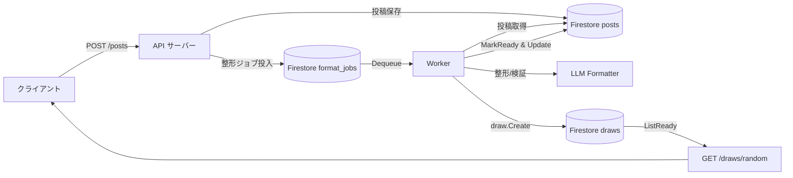
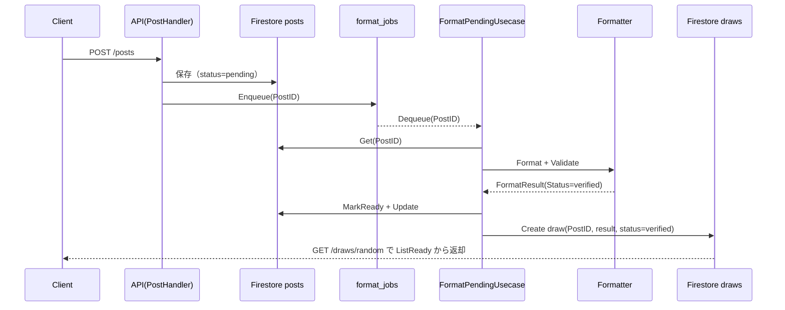

# 投稿整形〜draw 生成フロー

投稿 API → 整形ワーカー → draw 公開までの処理をまとめています。  
レイヤごとの役割を押さえた上でフロー図を読むと追いやすいです。

## 関与する主なレイヤ / コンポーネント

- `internal/domain/post`, `internal/domain/draw`  
  投稿（pending→ready）、おみくじ結果（pending/verified）の状態遷移ルールを保持。
- `internal/usecase/post.CreatePostUsecase`  
  `/posts` から受け取った投稿を Firestore `posts` へ保存し、整形待ちキュー `format_jobs` へ ID を enqueue。
- `internal/usecase/worker/FormatPendingUsecase`  
  キューから渡された Post ID を基に LLM 整形→検証→Post を ready へ更新→draw を生成。
- `internal/usecase/draw.FortuneUsecase`  
  `/draws/random` で `draws` コレクションから Verified な draw を返す。
- `internal/adapter/queue/firestore`  
  Post ID をやり取りする整形ジョブキュー（`format_jobs`）。
- `internal/adapter/repository/firestore`  
  `posts` / `draws` コレクションの実装。

## シーケンス（Mermaid）

- API は投稿を Firestore `posts` に保存しつつ整形ジョブを `format_jobs` キューへ投入する。
- Worker はキューから投稿 ID を取り出し、LLM 整形 → 検証を通過した投稿のみ `posts` を ready に更新した後、`draws` に結果を保存する。
- `/draws/random` は Verified な draw を `draws` から取得してクライアントへ返す。

このシーケンス図では posting→queue→worker のユースケース連携と、domain が enforcing する状態遷移（pending→ready, draw verified）の順序を示しています。
